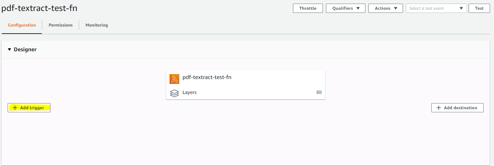
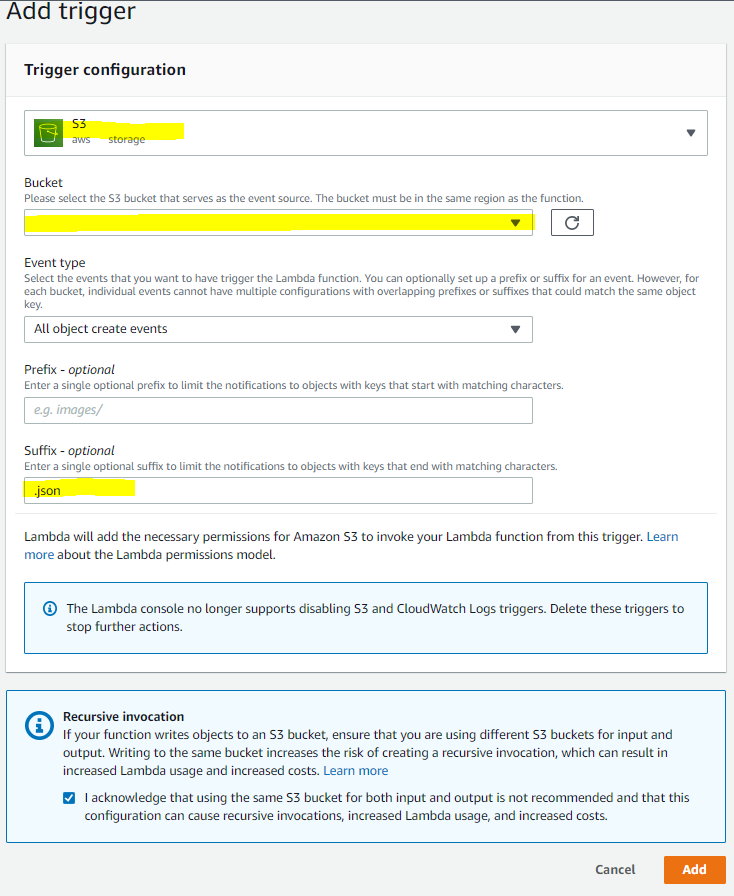

# UoT Textract Backend 
Deploying the backend application onto AWS Lambda. 

## Build Instructions 
This application requires the frontend Amplfy Application to be setup and running on the same account and region. 
1. Run the `create_lambda.bat` script for Windows machines or `create_lambda.sh` for Linux machines and follow the prompts 
2. In the AWS console, navigate to the newly created lambda function
3. Click on the Add Trigger Option 

4. Add a S3 create object trigger associated to the S3 bucket that Amplify created 

## Updates
If you make any updates to `index.py`, you must run `lambda.sh` on a machine with the same OS as Python3.8 in AWS Lambda 
    - see [here](https://docs.aws.amazon.com/lambda/latest/dg/lambda-python.html) for more information
